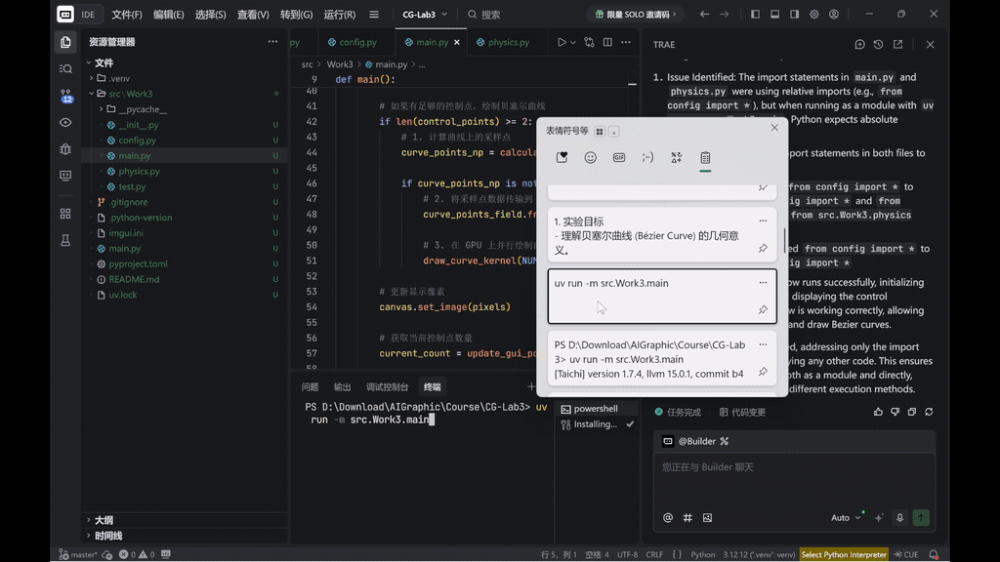
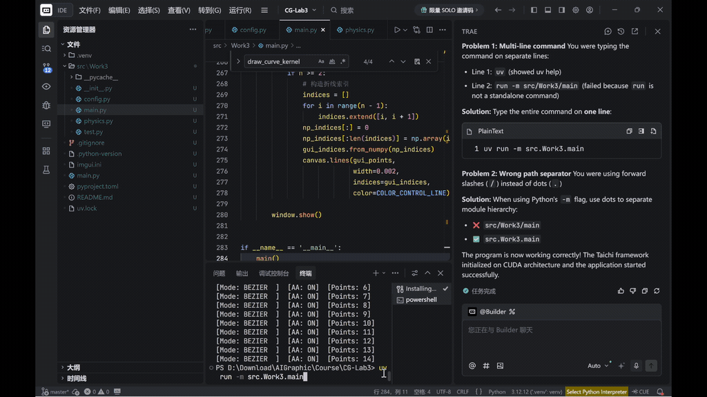
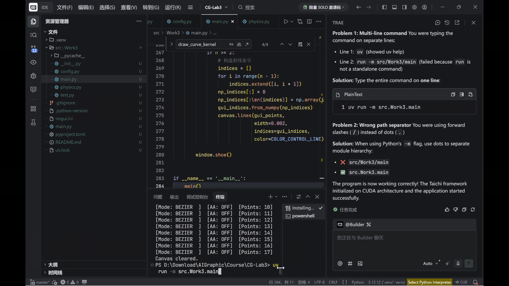
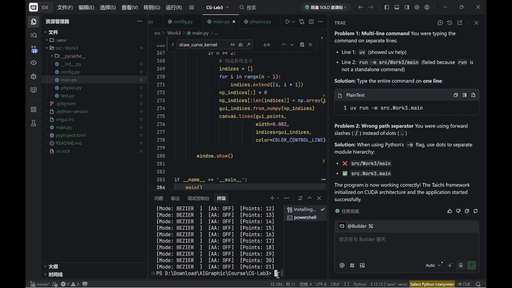

# Work3
本项目完成计算机图形学实验三
# CG-Lab3 · 贝塞尔曲线 · 反走样 · B 样条

## 项目框架

```
CG-Lab3/
├── src/
│   └── Work3/
│       ├── config.py       # 全局常量配置中心（尺寸、颜色、AA 参数）
│       ├── physics.py      # GPU 内核 + CPU 曲线算法
│       ├── main.py         # 主循环与交互逻辑
│       └── __init__.py
├── gif3                    #保存gif的文件夹
└── README.md
```

`config.py` 集中管理所有常量，修改参数只需改这一个文件。`physics.py` 包含 De Casteljau 算法、B 样条基函数及全部 GPU 光栅化内核，以 `@ti.kernel` 装饰运行在 GPU 并行环境中。`main.py` 负责初始化 Taichi、驱动每帧渲染循环、响应鼠标与键盘输入。

---

## 理论基础

### De Casteljau 算法

贝塞尔曲线由一组控制点决定。对于参数 $t \in [0,1]$，De Casteljau 算法通过递归线性插值求曲线上的精确坐标：

$$P_i^{(r)} = (1-t)\,P_i^{(r-1)} + t\,P_{i+1}^{(r-1)}$$

对 $n$ 个控制点执行 $n-1$ 轮插值，最终剩余的唯一点即为曲线在参数 $t$ 处的坐标。

### 反走样

基础光栅化将浮点坐标截断为整数，仅点亮单一像素，导致曲线边缘出现锯齿。反走样利用浮点坐标的亚像素精度，考察精确点周围 $3\times3$ 像素邻域，按距离分配颜色权重：

$$\text{weight} = \max\!\left(0,\ 1 - \frac{\text{dist}}{\text{radius}}\right)$$

颜色以累加方式写入邻域像素，距离越近贡献越大，实现边缘平滑过渡。

### 均匀三次 B 样条

B 样条通过引入固定基矩阵实现**局部控制**——每 4 个相邻控制点构成一段，移动任意控制点只影响附近曲线段。基矩阵形式为：

$$P(t) = \frac{1}{6}\begin{bmatrix}t^3&t^2&t&1\end{bmatrix}\begin{bmatrix}-1&3&-3&1\\3&-6&3&0\\-3&0&3&0\\1&4&1&0\end{bmatrix}\begin{bmatrix}P_0\\P_1\\P_2\\P_3\end{bmatrix}$$

$n$ 个控制点生成 $n-3$ 段曲线平滑拼接，且始终保持三次阶数不随控制点数量增加。

---

## 代码逻辑

```
main() 每帧执行：
│
├── 键盘 / 鼠标事件检测
│   ├── 鼠标左键            →  添加控制点到列表
│   ├── 键盘 C              →  清空控制点列表
│   ├── 键盘 B              →  切换 贝塞尔 / B 样条 模式
│   └── 键盘 A              →  开关反走样
│
├── clear_pixels()                   @ti.kernel  →  清空帧缓冲
│
├── [贝塞尔模式，控制点 ≥ 2]
│   ├── de_casteljau × 1001          CPU 循环采样曲线点
│   ├── curve_points_field.from_numpy()  →  1 次批量传输到 GPU
│   └── draw_curve_kernel / draw_curve_kernel_aa  @ti.kernel
│       ├── 基础版：浮点坐标截断 → 点亮单像素
│       └── AA版：3×3邻域距离权重累加 → 平滑像素
│
├── [B 样条模式，控制点 ≥ 4]
│   ├── b_spline_segment × (n-3) 段  CPU 分段采样
│   ├── curve_points_field.from_numpy()  →  1 次批量传输到 GPU
│   └── draw_curve_kernel / draw_curve_kernel_aa  @ti.kernel
│
├── canvas.set_image(pixels)         →  传帧显示
│
└── 绘制控制点与折线（对象池技巧）
    ├── np.full((MAX, 2), -10.0)     →  不可见占位
    ├── np_points[:n] = control_points  →  覆盖真实点
    ├── canvas.circles(gui_points)   →  红色控制点
    └── canvas.lines(gui_points, indices=gui_indices)  →  灰色折线
```

CPU 与 GPU 之间每帧只发生 **1 次** `from_numpy` 通信（Batching），而非逐点传输，是保证帧率流畅的关键。

---

## 实现功能

程序启动后弹出 800×800 的窗口，鼠标点击添加控制点后实时绘制曲线，红色圆点标记控制点，灰色折线连接控制多边形。

| 按键 | 功能 |
|------|------|
| 鼠标左键 | 添加控制点 |
| `C` | 清空画布与控制点 |
| `B` | 贝塞尔 ↔ B 样条模式切换 |
| `A` | 反走样开 / 关切换 |

曲线颜色同步反映当前状态：

| 颜色 | 状态 |
|------|------|
| 绿色 | 贝塞尔模式 · 反走样关 |
| 黄色 | 贝塞尔模式 · 反走样开 |
| 蓝色 | B 样条模式 |

---

## 创新点与优化方案

### 1. 基于距离权重的反走样光栅化

基础光栅化每个曲线点只点亮单一像素，斜线边缘出现明显锯齿。本项目在 GPU 内核中实现了亚像素级反走样：对每个精确浮点坐标，遍历周围 $3\times3$ 像素邻域，按欧氏距离线性衰减分配颜色权重并累加，无需增加采样点数量即可获得平滑边缘。相较于超采样（SSAA）方案，本方法计算开销固定为每点 9 次邻域写入，性能可控。

### 2. 均匀三次B样条的分段局部控制

贝塞尔曲线存在全局耦合问题——任意控制点的移动都会影响整条曲线，且阶数随控制点数线性增长。本项目在保留贝塞尔模式的基础上，新增均匀三次 B 样条支持：固定基矩阵使阶数始终为三次，n个控制点仅生成 $n-3$ 段独立曲线，每段只受相邻 4 个控制点影响，实现真正的局部控制。按 `B` 键可实时切换两种模式，直观对比几何行为差异。

### 3. GPU Batching——最小化跨界通信

朴素实现中，每算出一个曲线点就向 GPU Field 写一次数据，1000 个点产生 1000 次 PCIe 总线通信，帧率严重下降。本项目采用 Batching 策略：CPU 端一次性计算全部采样点并存入 NumPy 数组，通过单次 `from_numpy` 批量传输到 GPU，再由 `@ti.kernel` 并行光栅化。每帧跨界通信次数从 $O(N)$ 降至 $O(1)$，稳定保持 60 FPS。

### 4. 定长对象池——避免主循环动态内存分配

现代高性能渲染管线（Metal/Vulkan）极其反感主循环中的动态内存申请。`canvas.circles()` 要求定长 Field，控制点数量却实时变化。本项目预分配大小为 `MAX_CONTROL_POINTS=100` 的固定缓冲区，将多余位置填充为 $-10.0$（屏幕外不可见），每帧只覆盖真实控制点部分，无需任何动态分配，符合 GPU 渲染管线最佳实践。

### 5. 颜色即状态的视觉反馈系统

传统调试依赖控制台输出，用户体验割裂。本项目将程序状态直接编码到曲线颜色中：绿色（贝塞尔·无）、黄色（贝塞尔·有）、蓝色（B 样条），用户无需查看任何文字提示即可判断当前模式，交互体验更直观。颜色由 `config.py` 统一管理，扩展新模式只需新增一行常量。

---
## 效果展示
以下是贝塞尔曲线效果展示：
<div align="center">
  
  
      
</div>

以下是加了反走样和B样条的效果展示：
1.反走样模式下的贝塞尔曲线（黄色）-> B样条曲线（蓝色）
<div align="center">
    
</div>

2.反走样模式下的贝塞尔曲线（黄色）
<div align="center">
    
</div>

3.无反走样的贝塞尔曲线
<div align="center">
    
</div>
